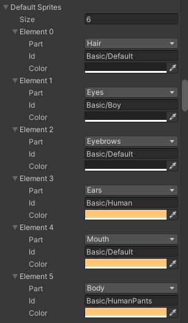
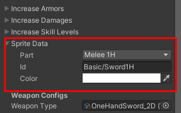
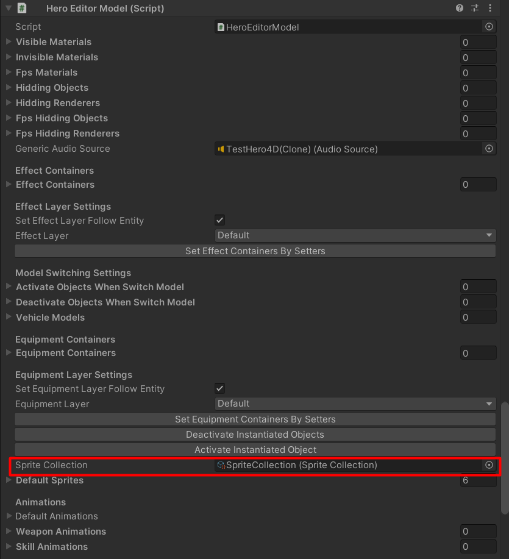
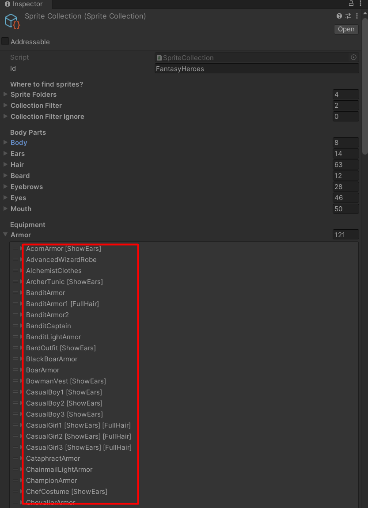

# UnityMultiplayerARPG_HeroEditor4D

Character model component integration for [Fantasy Heroes: 4-Directional Character Editor](https://assetstore.unity.com/packages/2d/characters/fantasy-heroes-4-directional-character-editor-147364)

## How to set default sprites

You can set default sprites which will appear when a character has no equipping items in `Hero Editor Component`

## How to set equipping item sprite

You can set equipping item sprite in item data -> `Sprite Data` field

## Where is sprite data's ID pulled from

It come from sprite collection, you can find which sprite collection that the character model is using from character model component (HeroEditorModel)

